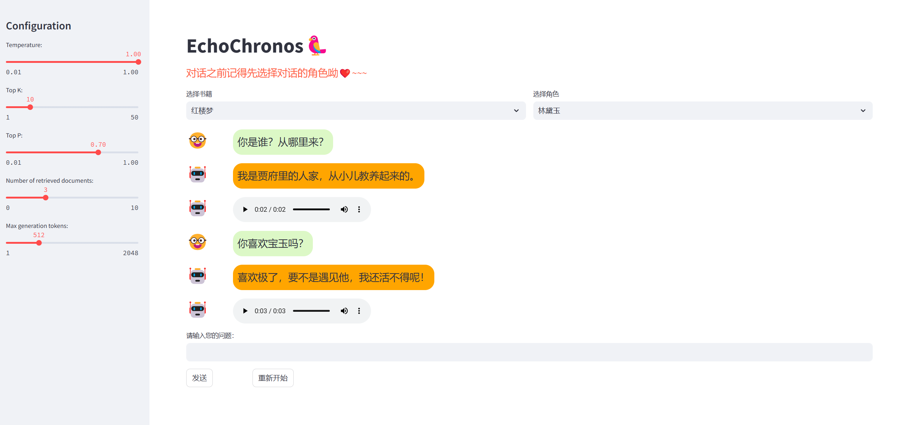

# EchoChronos 🥰

#### 介绍
EchoChronos（时光回声）是一款基于大模型的多模态风格对话智能助手，旨在为用户提供全新的风格式对话体验。该AI集成了RAG、TTS等多种技术，能够实现与用户的实时交互，让用户沉浸在与经典对话、与历史对话的魅力中。 🥸



#### 软件架构
```
EchoChronos
├─ ChatStyle  # ChatStyle模块
├─ managers   # 管理器模块，用于提供各个模块的接口
│  ├─ __init__.py
│  ├─ connect.py  # 连接管理器， 目前只有websocket连接方式
│  ├─ constants.py  # 常量
│  ├─ model.py  # 风格对话模型管理器
│  ├─ rag.py  # RAG模型管理器
│  ├─ runner.py  # 运行器管理器，用于编写推理等逻辑
│  └─ tts.py  # TTS模型管理器
├─ RAG  # RAG模块
├─ TTS  # TTS模块
├─ utils  # 工具包
├─ inference_torch.py  # 推理代码 PyTorch
├─ inference.py  # 推理代码 MindSpore
├─ launch.py  # 项目入口
├─ README.en.md
└─ README.md
```

#### 安装教程

python >= 3.11
``` shell
git clone --recursive https://gitee.com/xujunda2024/echochronos.git
cd echochronos
pip install -r requirements.txt
```

#### 使用说明

1.  准备一个python环境 ☝️🤓

2.  成功安装依赖之后，按照`examples/infer_qwen2_lora_fp32.yaml`的格式准备配置文件（记得按需求修改配置文件中的参数）。

3.  本项目暂时提供三个运行方式，可以通过修改yaml文件中的isTerminal，isWebsocket，isWebUI来改变运行方式：
    - Terminal: `python launch.py <your_yaml_path>`
    - WebSocket: `python launch.py <your_yaml_path>`
    - WebUI: `streamlit run launch.py <your_yaml_path>`

> [!TIP]
> MindSpore暂时只支持Terminal和WebSocket两种运行方式，入口为inference.py。
